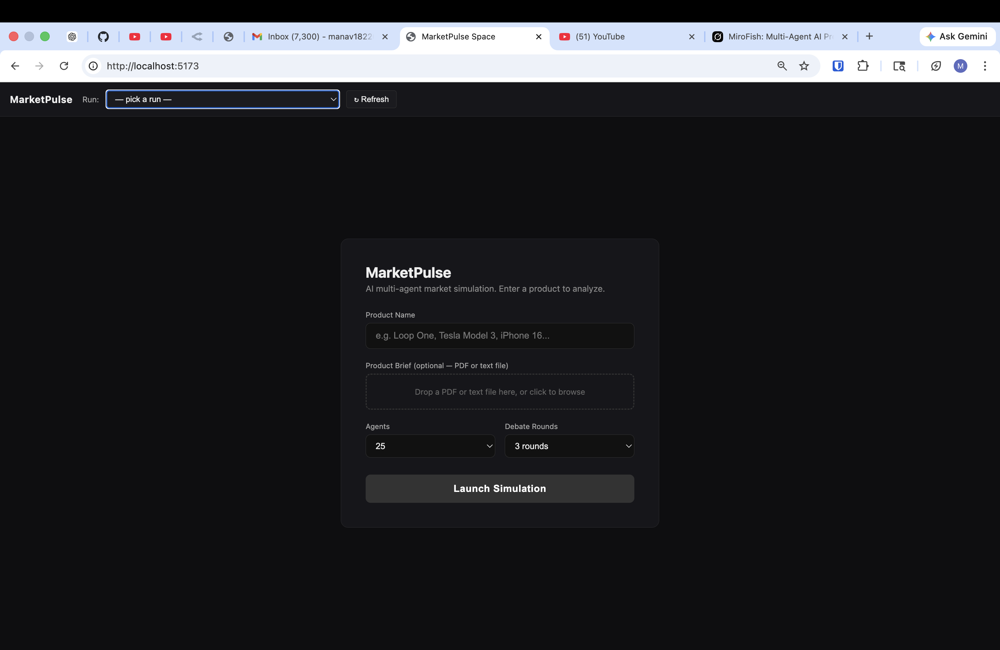
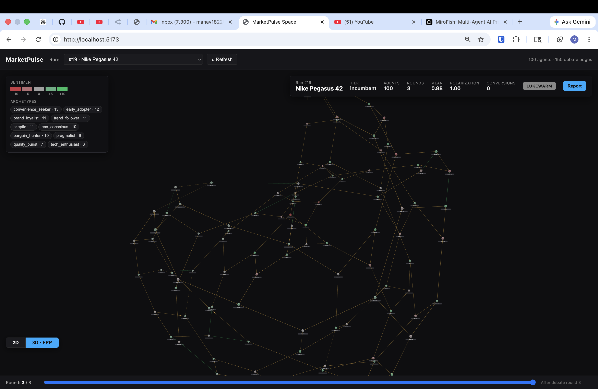
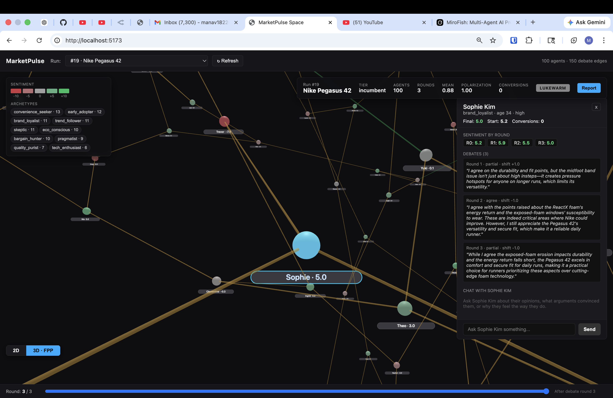

# MarketPulse

AI-powered market simulation. 25-100 consumer personas debate your product, shift opinions through argument, and produce a marketing intelligence report with risks, opportunities, and per-aspect breakdowns.

Give it a product name or upload a brief. It builds a panel of diverse consumers (skeptics, early adopters, bargain hunters, etc.), lets them argue for multiple rounds, and tells you what a real launch might look like — before you spend a dollar on marketing.

<p align="center">
  
</p>

<p align="center">
  
</p>

<p align="center">
  
</p>

## Quick Start

### Prerequisites

- [Docker Desktop](https://www.docker.com/products/docker-desktop/) (recommended) OR Python 3.12+ / Node 18+ / PostgreSQL
- An LLM API key: [OpenRouter](https://openrouter.ai/) (recommended, ~$0.02/run with DeepSeek), local [Ollama](https://ollama.ai/) (free), or Google Gemini

### Setup (Docker — one command)

```bash
git clone https://github.com/Manavpatel1823/MarketPulse.git
cd MarketPulse

cp .env.example .env
# Edit .env — set MARKETPULSE_API to your OpenRouter key

docker compose up
```

This starts three containers:

| Container | What it runs | Port |
|-----------|-------------|------|
| `db` | PostgreSQL 16 | 5432 |
| `backend` | FastAPI API server | 8000 |
| `frontend` | Vite React dev server | 5173 |

Open `http://localhost:5173`, enter a product name, and hit **Launch Simulation**.

To stop: `Ctrl+C` or `docker compose down`. Data persists in a Docker volume (`pgdata`).

### Setup (Manual — no Docker)

```bash
git clone https://github.com/Manavpatel1823/MarketPulse.git
cd MarketPulse

pip install -r requirements.txt

cp .env.example .env
# Edit .env with your API key and DATABASE_URL

createdb marketpulse

cd frontend && npm install && cd ..
```

Run the web UI (two terminals):
```bash
# Terminal 1
python3 run.py --serve

# Terminal 2
cd frontend && npm run dev
```

Or use the CLI directly:
```bash
python3 run.py "Fairphone 5"                       # web search + simulation
python3 run.py "MyProduct" --from-file brief.txt    # your own brief
python3 run.py "MyProduct" --from-url https://...   # fetch a product page
python3 run.py "MyProduct" --no-research            # skip research entirely
```

## What Happens When You Hit Launch

```
 Product name (or PDF brief)
          │
          ▼
 ┌─────────────────┐
 │  1. RESEARCH     │  Web search (DuckDuckGo) or parse your brief
 │                  │  → product info, competitors, market signals
 └────────┬────────┘
          ▼
 ┌─────────────────┐
 │  2. KNOWLEDGE    │  Extract entities + relationships (companies,
 │     GRAPH        │  supply chains, tech) into a graph
 └────────┬────────┘
          ▼
 ┌─────────────────┐
 │  3. AGENT PANEL  │  25-100 personas: skeptics, early adopters,
 │                  │  bargain hunters, brand loyalists, etc.
 └────────┬────────┘
          ▼
 ┌─────────────────┐
 │  4. OPINIONS     │  Each agent rates the product using category-
 │                  │  specific criteria (shoes → comfort, fit, weight)
 └────────┬────────┘
          ▼
 ┌─────────────────┐
 │  5. DEBATE       │  Agents paired adversarially (bull vs bear).
 │     ROUNDS       │  They argue, shift opinions, change minds.
 │                  │  ──── streams live to your browser ────
 └────────┬────────┘
          ▼
 ┌─────────────────┐
 │  6. REPORT       │  Distribution analysis, risks, competitive
 │                  │  positioning, aspect breakdown, 5 recommendations
 └─────────────────┘
```

## Features

- **Live visualization** — watch agents debate in real-time via WebSocket, see sentiment shift as it happens
- **3D graph browser** — explore past runs as interactive force-directed graphs, click any agent to see their full journey
- **Chat with agents** — after a simulation, ask any agent why they feel the way they do, what arguments convinced them
- **Domain-adaptive evaluation** — running shoes get rated on comfort/durability/fit; earbuds on performance/battery/build quality
- **Report download** — download the full marketing report as Markdown
- **Docker one-command setup** — `docker compose up` spins up Postgres, backend, and frontend

## Architecture

```
 Browser (:5173)  ──▶  Vite (proxy)  ──▶  FastAPI (:8000)  ──▶  PostgreSQL
                                               │
                                          LLM Backend
                                     (OpenRouter / Ollama / Gemini)
                                               +
                                     DuckDuckGo (web search)
```

| Endpoint | Description |
|----------|-------------|
| `POST /simulate` | Launch a new simulation |
| `WS /ws/live/:id` | Stream live debate events |
| `GET /runs` | List past runs |
| `GET /runs/:id/graph` | Graph data for visualization |
| `POST /runs/:id/agents/:id/chat` | Chat with an agent post-run |

## Configuration

All config is in `.env` (copy from `.env.example`):

| Variable | Default | Description |
|----------|---------|-------------|
| `BACKEND` | `openrouter` | LLM backend: `openrouter`, `ollama`, or `gemini` |
| `MARKETPULSE_API` | — | OpenRouter API key |
| `OPENROUTER_MODEL` | `deepseek/deepseek-chat-v3` | Model for OpenRouter |
| `OLLAMA_MODEL` | `qwen2.5:7b` | Model for local Ollama |
| `AGENT_COUNT` | `25` | Number of consumer agents (10-100) |
| `ROUNDS` | `3` | Debate rounds |
| `BATCH_SIZE` | `5` | Concurrent LLM calls |
| `DATABASE_URL` | — | PostgreSQL connection string (auto-set in Docker) |

## Tech Stack

**Backend:** Python 3.12, FastAPI, asyncpg, NetworkX, DuckDuckGo, Rich
**Frontend:** React, Zustand, Vite, react-force-graph-3d
**LLM:** OpenRouter (DeepSeek V3) / Ollama / Gemini
**Infra:** PostgreSQL, Docker Compose

## License

MIT
